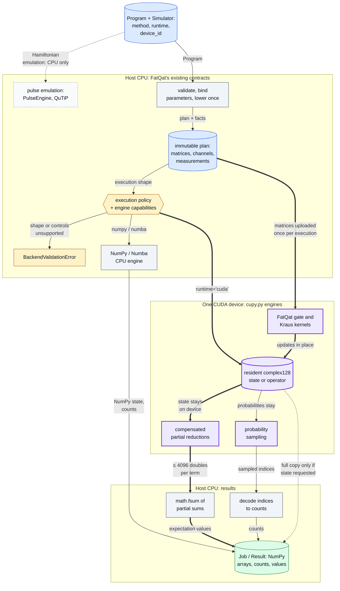
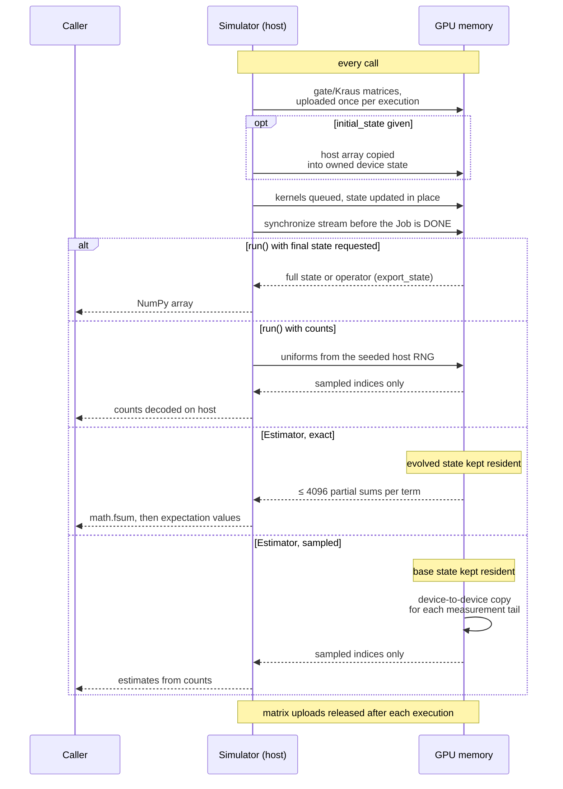

# FatQat CUDA backend

[](https://github.com/oscar-chw/fatqat-cuda/actions/workflows/cuda-fork-ci.yml)

A CUDA backend for the open-source FatQat simulator ([spaceqat/fatqat](https://github.com/spaceqat/fatqat)), which is written by the FatQat authors and released under Apache-2.0; this fork adds a GPU engine to it.
Developed by CHOI Hei Wang (Oscar), a student at The Chinese University of Hong Kong (CUHK), as part of coursework for CENG5280, 2026-27 Term 1.
With the r9 engines on both sides, one GPU runs a 24–28-qubit statevector observable 35–42× faster than compiled Numba on 32 CPU threads, and r9 doubles r8's GPU speed there with the same memory and bit-identical results ([Results](#results)).

The GPU is selected at the engine boundary: FatQat's validation, lowering and execution policy stay on the CPU, and only the numerical engine changes. The key path (heavy arrows) keeps the state on the device and sends back only what the call asked for.



Where in the code: `src/fatqat/simulator/simulator.py` (`Simulator.__init__`, `_validate_runtime_config`, `_execute_expectation_base`), `src/fatqat/simulator/planning.py`, `src/fatqat/simulator/_execution_policy.py`, `src/fatqat/simulator/_execution_contract.py` (`_EngineCapabilities`), `src/fatqat/simulator/_engine/` (`np.py`, `nb.py`, `cupy.py`), `src/fatqat/emulator/_core/engine.py` (`PulseEngine`).

## Why this exists

FatQat's general simulator runs on the CPU, through NumPy or compiled Numba.
Upstream did not have a GPU runtime. Dense simulation memory grows as `16·D`
bytes for a statevector, `16·D²` for a density matrix or unitary and `16·D⁴`
for a superoperator, where `D = 2^n` for `n` qubits. Each gate pass reads
and writes the whole array. The goal was a GPU path that keeps FatQat's
`Program`, `Job` and `Result` interfaces and its complex128 precision
unchanged.

## Approach

- `Simulator(method, runtime="cuda", device_id=...)` runs the **statevector,
  density-matrix, unitary and superoperator** methods on **one NVIDIA GPU**
  through CuPy. FatQat owns the kernels for one- and two-qubit gates. Wider
  gates and mixed subsystem dimensions fall back to CuPy tensor contraction.
- **complex128 throughout.** No reduced precision, fast-math, truncation or
  approximate channels.
- **Resident state.** Exact and sampled statevector and density-matrix
  Estimator calls keep the state on the GPU. Only the requested output, bounded
  partial sums or samples are copied back to the host.
- **GPU reductions with a compensated host sum.** Each GPU thread accumulates
  with compensated binary64 arithmetic. The host combines the partial sums with
  `math.fsum`.
- **GPU sampling.** Samples are drawn on the device from the seeded host
  random stream. The probability vector stays on the GPU.
- **Optional.** The `cuda13` and `cuda12` extras install CuPy. Without them
  nothing changes, and CuPy is imported only when a CUDA run starts.
- **CPU engines give the same results.** The NumPy engine gained an
  array-namespace hook that defaults to NumPy, so the CUDA engine can reuse
  its code; eight CPU fixtures were bit-identical to upstream at r8
  (`verification.json`).
- **r9: fewer passes over memory, same arithmetic.** Runs of qubit gates are
  applied tile by tile in GPU shared memory and, for the Numba CPU engine, in
  cache, bit-identical to per-gate kernels. Opt-in `simplify=True` merges and
  cancels only gates that never round (Paulis, `S`, `CX`, `SWAP`, ...), and
  `device_id=(0, 1, ...)` spreads `run_sweep` rows over several GPUs
  ([how, and why accuracy holds](docs/optimisations.md)).

What crosses between host and device on each kind of call. Everything not drawn as an arrow stays where it is.



Where in the code: `src/fatqat/simulator/_engine/cupy.py` (`_execution_scope`, `_matrix_array`, `_allocate`, `export_state`, `sample_indices`, `expectation_values`), `src/fatqat/simulator/simulator.py` (`_execute_expectation_base`, `_execute_sampled_expectation`); tests: `tests/simulator/test_cuda_resident.py`.

### Design decisions and trade-offs

- **complex128, not complex64.** Twice the memory and bandwidth per amplitude, in exchange for GPU results that match the CPU engines (≤ 3.1 eps against a 60-digit reference).
- **CuPy `RawKernel`s, not a compiled CUDA extension.** The GPU path stays an optional pip extra with nothing to build. The cost is a CuPy dependency and a compile step the first time each kernel runs (CuPy caches it on disk).
- **Hand-written kernels only for one- and two-qubit gates.** Wider gates and mixed dimensions use CuPy tensor contraction, which is correct but not tuned.
- **`simplify=True` merges only gates that never round.** Values stay bit-identical. Merging rotations or `H` was measured as less accurate ([why](docs/optimisations.md)), so those larger gains are given up.
- **Several GPUs split `run_sweep` rows, never one state.** No traffic between GPUs, and each row is computed exactly as on one GPU. The largest state is still bounded by one GPU's memory.

## Results

All figures are medians of warm public calls on 2026-10-06, complex128, including synchronisation and host output,
for two layers of RY/RZ on every qubit plus nearest-neighbour CX (the observable is three Pauli terms).
"CPU" is compiled Numba with `NUMBA_NUM_THREADS=32`; separate CPU runs varied, so the controlled comparisons are the same-run A/B files. Each row links its evidence.

| What was compared | Size | Result | Evidence |
| --- | --- | ---: | --- |
| r9 vs r8 engine, one GPU, same run (observable) | 24–28 qubits | 2.09–2.22× faster, same memory | [ab-r8-r9.json](results/ab-r8-r9.json) |
| One GPU vs CPU, both r9 (observable) | 24–28 qubits | 35–42× faster | [scaling-r9.json](results/scaling-r9.json), [scaling-r9-cpu.json](results/scaling-r9-cpu.json) |
| One GPU vs CPU, both r9 (full state copied back) | 24–28 qubits | 16–25× faster | [scaling-r9.json](results/scaling-r9.json), [scaling-r9-cpu.json](results/scaling-r9-cpu.json) |
| One GPU vs CPU, noisy density matrix and unitary (unchanged in r9) | 11–14 qubits | 2.6–12.6× faster | [scaling.json](results/scaling.json) |
| CPU only: Numba cache tiles vs per-gate passes, gate core | 22–26 qubits | 1.23–1.27× (CPU A), 1.30–1.55× (CPU B) | [cpu-tiles.json](results/cpu-tiles.json) |
| `simplify=True` on a Clifford-rich circuit, identical values | 22–28 qubits | CPU 1.7–1.9×, GPU 1.0–1.7× | [simplify.json](results/simplify.json) |
| Accuracy vs a 60-digit reference, 110 circuits, all four methods | up to 5 qubits | ≤ 3.1 eps on every runtime; GPU vs Numba −0.045 ± 0.031 eps | [precision.json](results/precision.json) |

- **The GPU does not always win.** Density-matrix and unitary runs at 6–8 qubits were 0.22–1.08× (mostly slower on the GPU), and noisy density matrices gain least (2.6–8× at 11–14 qubits).
- **r9 is not faster everywhere.** Density-matrix and unitary GPU code did not change (0.96–1.04× in the same-run comparison).
- **Accuracy is equal, not better.** GPU and Numba errors are statistically indistinguishable; NumPy is about 0.1 eps more accurate than both. Tiles and simplification give bit-identical results on Numba and CUDA.

How each change keeps accuracy and memory: [docs/optimisations.md](docs/optimisations.md). Every row, r7/r8 history and how to rerun: [docs/benchmarks.md](docs/benchmarks.md).

## Quick start

```sh
# CPU path, no GPU needed (Python 3.12+, pip 25.1+ for dependency groups)
python -m pip install --upgrade pip
python -m pip install --editable . --group dev --group qiskit
python -m pytest -q        # expect: all pass; the CUDA tests skip (CuPy not installed)
python -m pip install mpmath && PYTHON=python bash scripts/check.sh   # whole gate: tests, then the accuracy demo

# NVIDIA GPU: install exactly one CUDA extra matching your toolkit ('.[cuda12]' is the other)
python -m pip install --editable '.[cuda13]' --group dev --group qiskit mpmath
python -m pytest -q        # now also runs the CUDA tests; tests needing 2+ GPUs skip on one
```

Then use `Simulator("SV", runtime="cuda", device_id=0)` or `Simulator("DM", runtime="cuda", device_id=0)` from `fatqat.simulator`.
The r8 GPU run used CUDA 13.2 and CuPy 14.2 (`verification.json`); CI runs the CPU suite on Python 3.12 and 3.13.

## Project structure

```text
src/fatqat/                FatQat package; fork code: simulator/_engine/cupy.py, nb.py tiles, _backends/simplify.py
tests/                     upstream suite plus the CUDA tests (tests/simulator/test_cuda_*.py, test_cupy_*.py)
perf/                      precision, scaling and sweep benchmarks, and the publication scrub check
scripts/                   check.sh (tests, then demo.sh) and demo.sh (accuracy against a 60-digit reference)
results/                   scrubbed benchmark and precision records, and how to read them
docs/                      fork pages, the upstream README and design notes, the MkDocs site (docs/mkdocs/)
.github/workflows/         upstream tests and lint, plus the fork's CPU-path CI
LICENSE, NOTICE            Apache-2.0; the fork notice
pyproject.toml, mkdocs.yml, conftest.py, AGENTS.md, CONTRIBUTING.md, CODE_OF_CONDUCT.md   upstream project files
```

Docs: see [docs/README.md](docs/README.md).

## Limits

- **Not covered on the GPU:** pulse emulation; neutral-atom occupancy and loss (`AtomArraySimulator` rejects CUDA); stochastic statevector trajectories (CUDA statevectors reject channels, reset, mid-circuit measurement and feedforward); Apple GPUs; splitting one state across several GPUs ([coverage diagram](docs/cuda-coverage.md)).
- Small circuits can run faster on the CPU, because GPU launch costs can dominate.
- The CPU baseline is a fixed setting (`NUMBA_NUM_THREADS=32`), not every core; an all-cores comparison was not repeated for r9.
- Several GPUs help only `run_sweep`, and scale sublinearly because each row's Python-side work runs one thread at a time; one simulation is never split across GPUs.
- The CUDA 12 extra is packaged but has not been tested on a device.
- The benchmark source documents belong to a private research record and are not published; `results/benchmarks.json` is a scrubbed transcription.
- **Not merged upstream.** This is an independent fork and has not been submitted upstream.

## Lessons

- The baseline decides the headline: the same 24-qubit full-state run was about 22× faster than 4 CPU threads but about 3× faster than all cores.
- A GPU is not a free win: at 4 qubits the superoperator was a tie or a small loss, and small circuits can be faster on the CPU.
- Precision has to be tested, not assumed: against a 60-digit reference the GPU stays within 8 machine epsilons of the CPU, but is not better in every case.
- Swapping only the numerical engine, behind FatQat's own validation and lowering, kept `Program`, `Job` and `Result` unchanged and the CPU engines bit-identical on eight fixtures.

## Credits and licence

- FatQat, its source, documentation and tests are the work of the FatQat authors ([spaceqat/fatqat](https://github.com/spaceqat/fatqat)), Apache-2.0. Their README is kept in [docs/upstream-README.md](docs/upstream-README.md).
- The fork's CUDA engine, its tests and documentation are Copyright 2026 Oscar Choi, Apache-2.0; see [NOTICE](NOTICE) and [LICENSE](LICENSE).

Implemented with AI coding agents under Oscar's design and review.
