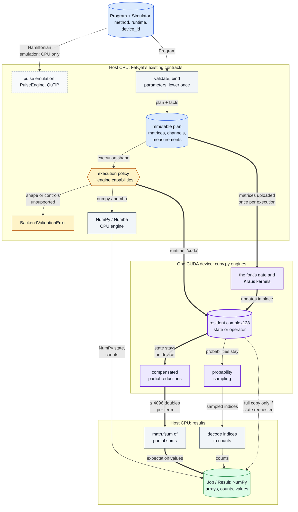
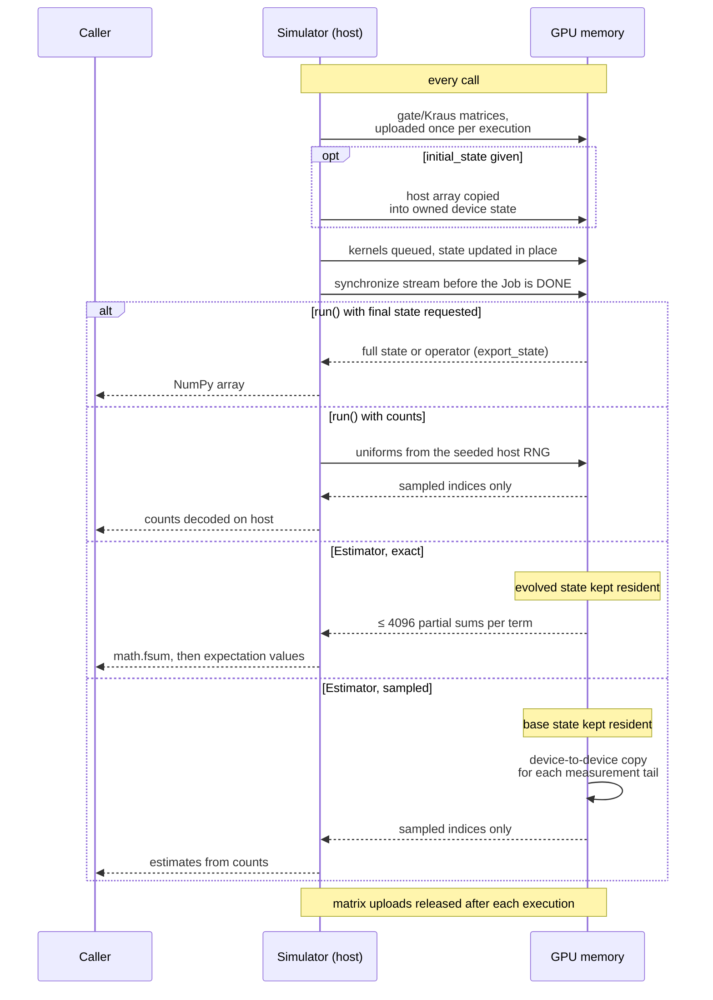

# FatQat CUDA backend

[](https://github.com/oscar-chw/fatqat-cuda/actions/workflows/cuda-fork-ci.yml)

A CUDA backend for the open-source FatQat simulator ([spaceqat/fatqat](https://github.com/spaceqat/fatqat)), which is written by the FatQat contributors and released under Apache-2.0; this fork adds a GPU engine to it.
Developed by CHOI Hei Wang (Oscar), a student at The Chinese University of Hong Kong (CUHK); the work was inspired by the course CENG5280.
With the r9 engines on both sides, one GPU runs a 24–28-qubit statevector observable 35–42× faster than compiled Numba on 32 CPU threads (a fixed setting, not every core), and r9 doubles r8's GPU speed there with the same memory and identical expectation values ([Results](#results)).

The GPU is selected at the engine boundary: FatQat's validation, lowering and execution policy stay on the CPU, and only the numerical engine changes. The key path (heavy arrows) keeps the state on the device and sends back only what the call asked for.



Where in the code: `src/fatqat/simulator/simulator.py` (`Simulator.__init__`, `_validate_runtime_config`, `_execute_expectation_base`), `src/fatqat/simulator/planning.py`, `src/fatqat/simulator/_execution_policy.py`, `src/fatqat/simulator/_execution_contract.py` (`_EngineCapabilities`), `src/fatqat/simulator/_engine/` (`np.py`, `nb.py`, `cupy.py`), `src/fatqat/emulator/_core/engine.py` (`PulseEngine`).

## Why this exists

FatQat's general simulator runs on the CPU, through NumPy or compiled Numba.
Upstream did not have a GPU runtime. Dense simulation memory grows as `16·D`
bytes for a statevector, `16·D²` for a density matrix or unitary and `16·D⁴`
for a superoperator, where `D = 2^n` for `n` qubits. Each gate pass reads
and writes the whole array. The goal was a GPU path that keeps FatQat's
`Program`, `Job` and `Result` interfaces and its complex128 precision
unchanged.

## Approach

- `Simulator(method, runtime="cuda", device_id=...)` runs the **statevector,
  density-matrix, unitary and superoperator** methods on **NVIDIA GPUs**
  through CuPy, one state per GPU. The fork's own kernels apply one- and two-qubit gates; wider
  gates and mixed subsystem dimensions fall back to CuPy tensor contraction.
- **complex128 throughout.** No reduced precision, fast-math, truncation or
  approximate channels.
- **Resident state.** Exact and sampled statevector and density-matrix
  Estimator calls keep the state on the GPU. Only the requested output, bounded
  partial sums or samples are copied back to the host.
- **GPU reductions with a compensated host sum.** Each GPU thread accumulates
  with compensated binary64 arithmetic. The host combines the partial sums with
  `math.fsum`.
- **GPU sampling.** Samples are drawn on the device from the seeded host
  random stream. The probability vector stays on the GPU.
- **Optional.** The `cuda13` and `cuda12` extras install CuPy. Without them
  nothing changes, and CuPy is imported only when a CUDA run starts.
- **CPU engines give the same results.** The NumPy engine gained an
  array-namespace hook that defaults to NumPy, so the CUDA engine can reuse
  its code; eight CPU fixtures were bit-identical to upstream at r8 (an
  unpublished verification record, not repeated since).
- **r9: fewer passes over memory, same arithmetic.** Runs of qubit gates are
  applied tile by tile in GPU shared memory and, for the Numba CPU engine, in
  cache, equal in value to per-gate kernels. Opt-in `simplify=True` merges and
  cancels only gates that never round (Paulis, `S`, `CX`, `SWAP`, ...), and
  `device_id=(0, 1, ...)` spreads `run_sweep` rows over several GPUs
  ([how, and why accuracy holds](docs/optimisations.md)).
- **r10: exact circuit algebra, wider tiles.** `simplify=True` multiplies
  gates out exactly in `Z[ω]/√2^k` (`ω = e^{iπ/4}`), so circuit identities such
  as `H·X·H = Z`, `T·T = S` and `(H⊗H)·CX·(H⊗H)` = reversed `CX` hold exactly,
  and `CX·RZ·CX` becomes one diagonal; from the all-zero state, gates on
  inputs still in a known basis state are dropped or shrunk. In tiles, controls
  and diagonal gates no longer take a tile bit, so a QFT needs one pass per
  tile of Hadamards.
- **r11: noisy runs on the GPU, shared work between shots, several GPUs.** CUDA
  statevectors now run per-shot trajectories (finite channels, reset,
  mid-circuit measurement, feedforward), drawing from each shot's own seed
  stream in NumPy's order. Shots that share a state share the work on it
  (shot branching) on each runtime's per-shot loop, with counts
  bit-identical to running the shots one at a time. `device_id="all"` uses every visible GPU, and a
  run's shots are split over them with one worker process per further GPU
  ([how](docs/optimisations.md)).

What crosses between host and device on each kind of call. Everything not drawn as an arrow stays where it is.



Where in the code: `src/fatqat/simulator/_engine/cupy.py` (`_execution_scope`, `_matrix_array`, `_allocate`, `export_state`, `sample_indices`, `expectation_values`), `src/fatqat/simulator/simulator.py` (`_execute_expectation_base`, `_execute_sampled_expectation`); tests: `tests/simulator/test_cuda_resident.py`.

### Design decisions and trade-offs

- **complex128, not complex64.** Twice the memory and bandwidth per amplitude, in exchange for GPU results that match the CPU engines (≤ 3.1 eps against a 60-digit reference, on circuits of up to 5 subsystems).
- **CuPy `RawKernel`s, not a compiled CUDA extension.** The GPU path stays an optional pip extra with nothing to build. The cost is a CuPy dependency and a compile step the first time each kernel runs (CuPy caches it on disk).
- **Hand-written kernels only for one- and two-qubit gates.** Wider gates and mixed dimensions use CuPy tensor contraction, which is correct but not tuned.
- **`simplify=True` uses exact algebra, not floating point.** A run becomes its product only if that rounds no more, and the product is rounded once. Rewrites of exact gates keep values the same on Numba and CUDA (NumPy, through BLAS, can differ in the last bit); cancelling rounding gates brings results closer to the ideal circuit on average (0.78 vs 2.92 eps), though there is no per-circuit bound: 6 of 48 measured circuits ended up slightly worse (at most 0.061 eps). The price is fewer rewrites: a rotation merges only with `±1` permutations, never with another rotation ([why](docs/optimisations.md)).
- **Several GPUs split `run_sweep` rows or a run's shots, never one state.** `device_id="all"` uses every visible GPU. There is no traffic between GPUs, and each row or shot is computed exactly as on one GPU, so counts equal a one-GPU run with the same seed on GPUs of the same model. The largest state is still bounded by one GPU's memory.
- **One worker process per extra GPU, not threads.** Each shot's loop is mostly Python, and threads take turns on the interpreter lock: two GPUs on threads were 0.67–0.80× of one at 20 qubits (an unpublished measurement). Worker processes cost a start-up the first time and an idle process per extra GPU for five minutes, in exchange for 1.64–1.90× on two GPUs.
- **Shot branching shares work without changing a single draw.** Shots that share a state are evolved as one group; at each random step every shot still draws from its own stream, in its own order, so counts are bit-identical to the one-at-a-time loop. The price is memory for the groups waiting their turn, held to 1 GiB or 8 states within half the free memory; past that, a group runs shot by shot.

## Results

Timing rows are medians of warm calls on 2026-10-06 (r11 rows: 2026-10-07), complex128. Unless a row says otherwise they are public calls, including synchronisation and host output,
on two layers of RY/RZ on every qubit plus nearest-neighbour CX (the observable is three Pauli terms).
"CPU" is compiled Numba with `NUMBA_NUM_THREADS=32`; separate CPU runs varied, so the controlled comparisons are the same-run A/B files. Each row links its evidence.

| What was compared | Size | Result | Evidence |
| --- | --- | ---: | --- |
| r9 vs r8 engine, one GPU, same run (observable) | 24–28 qubits | 2.09–2.22× faster, same memory | [ab-r8-r9.json](results/ab-r8-r9.json) |
| One GPU vs CPU, both r9 (observable) | 24–28 qubits | 35–42× faster | [scaling-r9.json](results/scaling-r9.json), [scaling-r9-cpu.json](results/scaling-r9-cpu.json) |
| One GPU vs CPU, both r9 (full state copied back) | 24–28 qubits | 16–25× faster | [scaling-r9.json](results/scaling-r9.json), [scaling-r9-cpu.json](results/scaling-r9-cpu.json) |
| One GPU vs CPU, noisy density matrix and unitary (r8 code) | 11–14 qubits | 2.6–12.6× faster | [scaling.json](results/scaling.json) |
| Unitary method with gate tiles vs without, one GPU, same run | 12–14 qubits | 1.28–1.42× faster, same memory | [ab-unitary-tiles.json](results/ab-unitary-tiles.json) |
| r10 tiles (controls and diagonals take no tile bit) vs r9 tiles, same engine, QFT, adder, QAOA, Clifford+T | 24–26 qubits | GPU 1.06–2.48× (QFT 47 → 7 passes), CPU 1.48–1.68× (QFT 27 → 5 passes); equal values | [tile-check-cuda.json](results/tile-check-cuda.json), [tile-check.json](results/tile-check.json) |
| r10 `simplify=True` on a Clifford+T adder, QAOA and redundant Clifford+T | 20 (CPU), 26 (GPU) qubits | CPU 1.8–4.3×, GPU 1.0–2.75×; mean error vs the ideal circuit 0.8 eps, not 2.9–3.1 (6 of 48 circuits up to 0.061 eps worse; no per-circuit bound) | [simplify-check.json](results/simplify-check.json), [simplify-check-cuda.json](results/simplify-check-cuda.json) |
| r10 accuracy vs a 60-digit reference, 110 circuits, all four methods | up to 5 subsystems (qubits and qutrits) | ≤ 2.9 eps on every runtime; GPU vs Numba −0.047 ± 0.033 eps | [precision-r10.json](results/precision-r10.json) |
| r11 shot branching vs every shot alone, same run (mid-circuit measurement, low and high noise) | 16–18 qubits, CPU | NumPy 1.21–12×, never slower in the 12 measured cells; counts equal | [branching-check.json](results/branching-check.json) |
| r11 shot branching vs every shot alone, one GPU, same run | 20–24 qubits | measured circuits 19–77×, low noise 1.9–4.9×, high noise 1.16×; counts equal | [shots-cuda.json](results/shots-cuda.json) |
| r11 two GPUs vs one for a run's shots, same run | 20–26 qubits | noisy runs 1.64–1.90×; measured circuits 0.98–1.07× (little left to split); never below the 0.95 timing-noise floor; counts equal | [shots-cuda.json](results/shots-cuda.json) |
| r11 accuracy, the same 110 circuits | up to 5 subsystems | identical to r10 on every circuit and runtime | [precision-r11.json](results/precision-r11.json) |

- **The GPU does not always win.** Density-matrix and unitary runs at 6–8 qubits were 0.22–1.38× in one run (6 of 9 slower on the GPU, one a tie) and varied between runs; noisy density matrices returned in full gain least (2.6–8× at 11–14 qubits), while noisy density-matrix observables gain 10–12.6×.
- **r9 is not faster everywhere.** Density-matrix GPU code did not change (0.97–1.02× in the same-run comparison), and the unitary gain is GPU-only: a simple CPU counterpart (narrower column blocks) was measured slower and not adopted.
- **GPU accuracy is equal, not better.** r10 computes each part of a complex product with Kahan's algorithm for 2×2 determinants, within 2 ulp even under cancellation; GPU and Numba errors are still statistically indistinguishable (the GPU 0.047 eps ahead, standard error 0.033), and NumPy is 0.11–0.15 eps ahead of both. Tiles give values equal to per-gate passes. `simplify` keeps values unchanged where it rewrites only exact gates, and on average comes closer to the ideal circuit where rounding gates cancel.
- **Shot branching pays most where shots agree.** A circuit with mid-circuit measurements but no noise has few branches, and gains 19–77×; at high noise most shots soon run alone, and the gain falls to 1.16–1.43×. Numba's own compiled multi-shot loop, which default counts-only Numba runs use, is not changed (its forced per-shot path gains 1.26–71×).
- **On the GPU, `simplify` pays only on large states.** At 20 qubits a GPU applies a gate in microseconds and planning cost more than it saved (an unpublished measurement); at 26 qubits it gains up to 2.75×, and on a Toffoli adder, whose gates already tile well, nothing.

Every experiment, its parameters, what was tried and dropped, and how to rerun it: [docs/experiments.md](docs/experiments.md). How each change keeps accuracy and memory: [docs/optimisations.md](docs/optimisations.md). r7/r8 history: [docs/benchmarks.md](docs/benchmarks.md).

## Quick start

```sh
# CPU path, no GPU needed (Python 3.12+, pip 25.1+ for dependency groups)
python -m pip install --upgrade pip
python -m pip install --editable . --group dev --group qiskit --group perf
python -m pytest -q        # expect: all pass; the CUDA tests skip (CuPy not installed)
PYTHON=python bash scripts/check.sh   # whole gate: tests, then the accuracy demo

# NVIDIA GPU: install exactly one CUDA extra matching your toolkit ('.[cuda12]' is the other)
python -m pip install --editable '.[cuda13]' --group dev --group qiskit --group perf
python -m pytest -q        # now also runs the CUDA tests; tests needing 2+ GPUs skip on one
```

Then use `Simulator("SV", runtime="cuda", device_id=0)` or `Simulator("DM", runtime="cuda", device_id=0)` from `fatqat.simulator`; `device_id="all"` uses every visible GPU. Device selection, memory, errors and debug logging (`logging.getLogger("fatqat").setLevel(logging.DEBUG)`): the [CUDA runtime guide](docs/mkdocs/en/api/cupy-simulator.md).
The r8 GPU run used CUDA 13.2 and CuPy 14.2 (unpublished verification record); CI runs the CPU suite, precision harness included, on Python 3.12 and 3.13.

## Project structure

```text
src/fatqat/                FatQat package; fork code: simulator/_engine/cupy.py, nb.py tiles, _backends/simplify.py
tests/                     upstream suite plus the CUDA tests (tests/simulator/test_cuda_*.py, test_cupy_*.py)
perf/                      precision, scaling and sweep benchmarks, and the publication scrub check
scripts/                   check.sh (tests, then demo.sh) and demo.sh (accuracy against a 60-digit reference)
results/                   scrubbed benchmark and precision records, and how to read them
prototypes/metal/          Apple-GPU prototype: software binary64, the tile kernel in Metal, CPU+GPU split
docs/                      fork pages, the upstream README and design notes, the MkDocs site (docs/mkdocs/)
.github/workflows/         upstream tests and lint, plus the fork's CPU-path CI
LICENSE, NOTICE            Apache-2.0; the fork notice
pyproject.toml, mkdocs.yml, conftest.py, AGENTS.md, CONTRIBUTING.md, CODE_OF_CONDUCT.md   upstream project files
```

Docs: see [docs/README.md](docs/README.md).

## Limits

- **Not covered on the GPU:** pulse emulation; neutral-atom occupancy and loss (`AtomArraySimulator` rejects CUDA); splitting one state across several GPUs ([coverage diagram](docs/cuda-coverage.md)). Apple GPUs have no FP64 arithmetic: a [prototype](prototypes/metal/README.md) does binary64 in software, bit-identical to Numba's tiles, and sharing each tile batch between the Apple GPU and the CPU is 1.24–1.48× faster than the CPU alone at 24–26 qubits, but it is not a FatQat runtime.
- The CPU baseline is a fixed setting (`NUMBA_NUM_THREADS=32`), not every core; an all-cores comparison was not repeated for r9.
- Several GPUs help `run_sweep` and runs of independent shots (trajectories); a single ideal run uses one GPU, and so does a shot run that requests its final state. Two GPUs gave 1.64–1.90× on noisy runs at 20–26 qubits and nothing on short measured circuits; more than two were not measured for shots, and sweeps scale sublinearly because each row's Python-side work runs one thread at a time. One state is never split across GPUs.
- CUDA trajectories draw from each shot's own seed stream in the order NumPy does, so a seed selects the same branches as `runtime="numpy"` wherever the branch probabilities agree to the last bit; GPU and CPU round-off differ by design (equal accuracy, not identical bits).
- The CUDA 12 extra is packaged but has not been tested on a device.
- The benchmark source documents belong to a private research record and are not published; `results/benchmarks.json` is a scrubbed transcription.
- **Not merged upstream.** This is an independent fork and has not been submitted upstream.

## What I learned

- The baseline decides the headline: the same 24-qubit full-state run was about 22× faster than 4 CPU threads but about 3× faster than all cores.
- A GPU is not a free win: at 4 qubits the superoperator was a tie or a small loss, and small circuits can be faster on the CPU.
- Exact arithmetic beats tolerances: merging `H·H` in binary64 biased every amplitude, while deciding `H·X·H = Z` in `Z[ω]/√2^k` removes the rounding instead of adding it.
- Precision has to be tested, not assumed: against a 60-digit reference every runtime stays within 3.1 machine epsilons (r9), and GPU and compiled-CPU errors are statistically indistinguishable, but the GPU is not more accurate.
- Swapping only the numerical engine, behind FatQat's own validation and lowering, kept `Program`, `Job` and `Result` unchanged and the CPU engines bit-identical on eight fixtures (unpublished record).

## Credits and licence

- FatQat, its source, documentation and tests are the work of the FatQat contributors ([spaceqat/fatqat](https://github.com/spaceqat/fatqat)), Apache-2.0. Their README is kept in [docs/upstream-README.md](docs/upstream-README.md).
- The fork's additions (the CUDA engine, gate tiles, exact simplification, noisy GPU trajectories, shot branching, multi-GPU sweeps and shot runs, the Metal prototype) and their tests and documentation are Copyright 2026 CHOI Hei Wang (Oscar), released under Apache-2.0 like FatQat itself; see [NOTICE](NOTICE) and [LICENSE](LICENSE).

Implemented with AI coding agents under CHOI Hei Wang's design and review.
