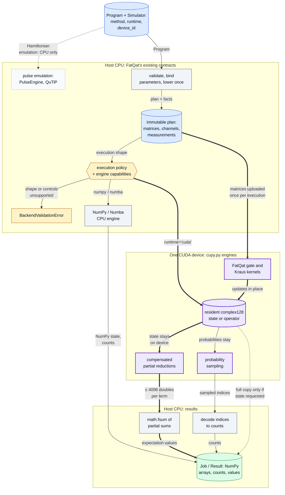
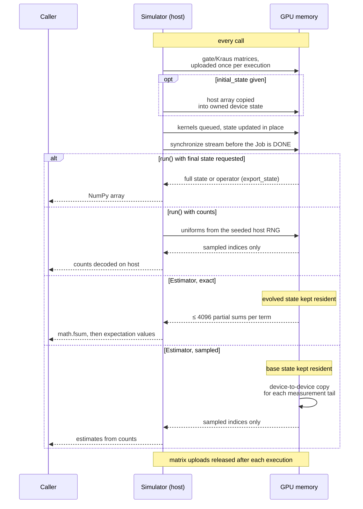
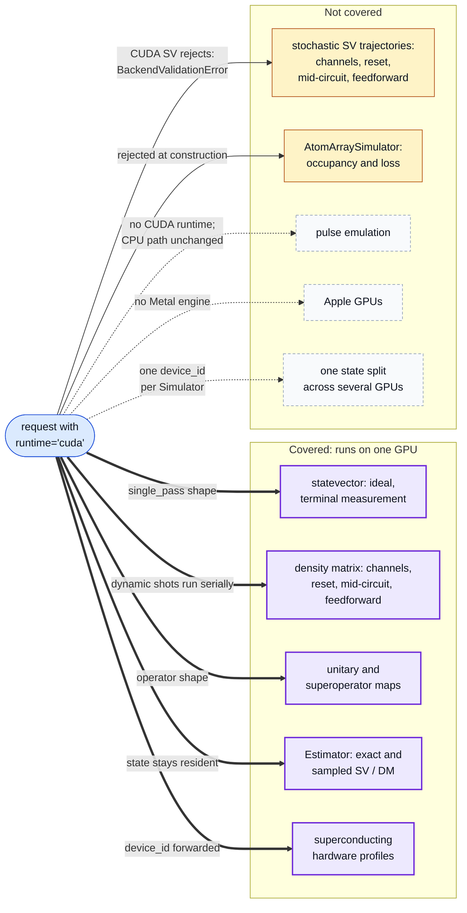

# FatQat CUDA backend

[](https://github.com/oscar-chw/fatqat-cuda/actions/workflows/cuda-fork-ci.yml)

A CUDA backend for the open-source FatQat simulator ([spaceqat/fatqat](https://github.com/spaceqat/fatqat)).
FatQat is written by the FatQat authors and released under Apache-2.0. This
fork adds a GPU engine to it. The upstream README is kept further down,
unchanged apart from its heading and one paragraph on installing CUDA.

Developed by CHOI Hei Wang (Oscar), a student at The Chinese University of Hong Kong (CUHK),
as part of coursework for CENG5280, 2026-27 Term 1.

Implemented with AI coding agents under Oscar's design and review.

The GPU is selected at the engine boundary: FatQat's validation, lowering and execution policy stay on the CPU, and only the numerical engine changes. The key path (heavy arrows) keeps the state on the device and sends back only what the call asked for.



Where in the code: `src/fatqat/simulator/simulator.py` (`Simulator.__init__`, `_validate_runtime_config`, `_execute_expectation_base`), `src/fatqat/simulator/planning.py`, `src/fatqat/simulator/_execution_policy.py`, `src/fatqat/simulator/_execution_contract.py` (`_EngineCapabilities`), `src/fatqat/simulator/_engine/` (`np.py`, `nb.py`, `cupy.py`), `src/fatqat/emulator/_core/engine.py` (`PulseEngine`).

## Problem

FatQat's general simulator runs on the CPU, through NumPy or compiled Numba.
Upstream did not have a GPU runtime. Dense simulation memory grows as `16·D`
bytes for a statevector, `16·D²` for a density matrix or unitary and `16·D⁴`
for a superoperator, where `D = 2^n` for `n` qubits. Each gate pass reads
and writes the whole array. The goal was a GPU path that keeps FatQat's
`Program`, `Job` and `Result` interfaces and its complex128 precision
unchanged.

## What this fork adds

- `Simulator(method, runtime="cuda", device_id=...)` runs the **statevector,
  density-matrix, unitary and superoperator** methods on **one NVIDIA GPU**
  through CuPy. FatQat owns the kernels for one- and two-qubit gates. Wider
  gates and mixed subsystem dimensions fall back to CuPy tensor contraction.
- **complex128 throughout.** No reduced precision, fast-math, truncation or
  approximate channels.
- **Resident state.** Exact and sampled statevector and density-matrix
  Estimator calls keep the state on the GPU. Only the requested output, bounded
  partial sums or samples are copied back to the host.
- **GPU reductions with a compensated host sum.** Each GPU thread accumulates
  with compensated binary64 arithmetic. The host combines the partial sums with
  `math.fsum`.
- **GPU sampling.** Samples are drawn on the device from the seeded host
  random stream. The probability vector stays on the GPU.
- **Optional.** The `cuda13` and `cuda12` extras install CuPy. Without them
  nothing changes, and CuPy is imported only when a CUDA run starts.
- **CPU engines unchanged in behaviour.** The NumPy engine gained an
  array-namespace hook that defaults to NumPy, so the CUDA engine can reuse
  its code. Eight CPU fixtures, RNG state included, are bit-identical to
  upstream (`verification.json`).

What crosses between host and device on each kind of call. Everything not drawn as an arrow stays where it is.



Where in the code: `src/fatqat/simulator/_engine/cupy.py` (`_execution_scope`, `_matrix_array`, `_allocate`, `export_state`, `sample_indices`, `expectation_values`), `src/fatqat/simulator/simulator.py` (`_execute_expectation_base`, `_execute_sampled_expectation`); tests: `tests/simulator/test_cuda_resident.py`.

Coverage and per-method restrictions are in the
[CUDA runtime guide](docs/mkdocs/en/api/cupy-simulator.md).

## Results

**r8 = the committed code.** The GPU-vs-CPU ratios below were measured on
earlier engine revisions (r7 and v5). r8 changed only the CUDA engine, and its
gain over r7 is shown separately. r8 has not been timed against the CPU.

Each figure is a median of 5 or 6 warm public calls, measured on 2026-09-15.
The workloads are two layers of RY/RZ on every qubit plus nearest-neighbour CX,
run in complex128. The noisy cases add amplitude damping (p=0.07) and phase
damping (p=0.02). An observable is the exact expectation of three Pauli terms.
Timing includes GPU synchronisation and the requested host output. Each entry
says how many times faster the GPU (or r8) was. Below 1 means slower.

| Workload | GPU vs CPU 4 threads (r7) | GPU vs CPU all cores (r7) | GPU vs CPU 16 workers (v5) | r8 vs r7, GPU only | Evidence |
| --- | ---: | ---: | ---: | ---: | --- |
| 24-qubit statevector, full state | 21.83× | 3.25× | 10.14× | 1.09× | CROSS_ARCHITECTURE_RESULTS.md; CUDA_IMPLEMENTATION_RESULTS.md |
| 24-qubit statevector, observable | 34.75× | 6.00× | not run | 1.15× | CROSS_ARCHITECTURE_RESULTS.md; CUDA_IMPLEMENTATION_RESULTS.md |
| 11-qubit noisy density matrix, full | 8.04× | 1.75× | 2.38× | 1.60× | CROSS_ARCHITECTURE_RESULTS.md; CUDA_IMPLEMENTATION_RESULTS.md |
| 11-qubit noisy density matrix, observable | 10.17× | 1.63× | not run | 1.90× | CROSS_ARCHITECTURE_RESULTS.md; CUDA_IMPLEMENTATION_RESULTS.md |
| 11-qubit unitary | 12.42× | 4.80× | 10.04× | 1.10× | CROSS_ARCHITECTURE_RESULTS.md; CUDA_IMPLEMENTATION_RESULTS.md |
| 4-qubit noisy superoperator | not run | not run | 0.98× (GPU 1.02× slower) | 1.27× | CROSS_ARCHITECTURE_RESULTS.md; CUDA_IMPLEMENTATION_RESULTS.md |

- **The baselines differ in strength.** "All cores" was the fastest CPU setting
  recorded, and its runs varied widely: for example, the 24-qubit observable
  ranged from 276.8 to 618.1 ms. The 16-worker setting is a weaker baseline,
  and v5 is an older engine. GPU runs gave the host process 16 CPU threads.
- **The GPU does not always win.** The 4-qubit superoperator was a tie or a
  small loss.
- **r8 vs r7 on the same GPU workloads.** The noisy 11-qubit observable went
  from 26.539 to 14.004 ms. Tracked live GPU memory for the 11-qubit noisy
  density matrix went from 192.130 to 128.065 MiB. r8 is not faster
  everywhere: the 9-qubit unitary was 1.9% slower, and dense two-qubit
  fixtures stayed between 0.98× and 1.10×.
- **Precision:** within 8 machine epsilons of the CPU engine; equal-or-better
  in every case is not established. The tests compare against an independent
  60-digit reference with `atol=1e-12` and `rtol=0`, and require each GPU
  error to be at most each CPU engine's error plus `8·eps(float64)`. Evidence:
  `verification.json` (r8), `verification-r7.json`, `FQ020_VERIFICATION.json`.

Every row, with its median milliseconds and source document, is in
[`results/benchmarks.json`](results/benchmarks.json). See
[`results/README.md`](results/README.md) for how to read it. The source
documents named there belong to a private research record and are not
published.

**Experiments (not in this code).** Unmerged variants measured against r8
reached 382.7 → 232.2 ms on a 13-qubit noisy density-matrix observable and
66.1 → 45.3 ms on the 24-qubit full statevector. They are not part of this
repository and no claim is made for them. Source: `CUDA_EXPERIMENT_RESULTS.md`.

## How to run

The CPU path needs no GPU. Python 3.12 or newer is required, and pip 25.1 or
newer is needed for dependency groups. From a checkout of this repository:

```sh
python -m pip install --upgrade pip
python -m pip install --editable . --group dev --group qiskit
python -m pytest -q
```

Locally on the CPU path this gives 2906 passed and 120 skipped. All 120 skips
are CUDA tests that skip because CuPy is not installed. CI runs the same suite
on Python 3.12 and 3.13.

To use the GPU on a machine with an NVIDIA GPU, install exactly one CUDA extra
that matches your CUDA Toolkit:

```sh
python -m pip install --editable '.[cuda13]' --group dev --group qiskit mpmath   # or '.[cuda12]'
```

```python
from fatqat.simulator import Simulator

ideal = Simulator("SV", runtime="cuda", device_id=0)
noisy = Simulator("DM", runtime="cuda", device_id=0)
```

With CuPy and a device available, the same `pytest` command also runs the CUDA
tests. `mpmath` is needed for their 60-digit reference checks. On r8 the
suite passed 3026 tests with no skips (`verification.json`). That run used
CUDA 13.2 and CuPy 14.2. The CUDA 12 extra is packaged but has
not been tested on a device.

## Limits

Which requests run on the GPU, and what happens to the rest: thin solid arrows end in `BackendValidationError`, dotted ones have no CUDA path at all.



Where in the code: `src/fatqat/simulator/simulator.py` (`_validate_runtime_config`), `src/fatqat/simulator/_engine/cupy.py` (`_supported_execution_shapes`, `CupySVEngine.materialize_execution`), `src/fatqat/simulator/fake_atom_array.py`, `src/fatqat/simulator/fake_superconducting.py`; coverage table: [CUDA runtime guide](docs/mkdocs/en/api/cupy-simulator.md).

- **Not covered:**
  - pulse emulation;
  - neutral-atom occupancy and loss (`AtomArraySimulator` rejects CUDA);
  - stochastic statevector trajectories (CUDA statevectors reject channels,
    reset, mid-circuit measurement and feedforward);
  - Apple GPUs;
  - splitting one state across several GPUs.
- Small circuits can run faster on the CPU, because GPU launch costs can
  dominate.
- **Not merged upstream.** This is an independent fork and has not been
  submitted upstream.

---

# Upstream FatQat README

FatQat is a quantum-computing toolkit built around one authoring interface:
`Program`. Write the computation once, then choose how closely to model the
machine beneath it.

> **Development status:** FatQat is under active development, and its interfaces
> may change between releases. Pin an exact version when reproducibility matters.

| Execution level | Start here when you want to… |
| --- | --- |
| General simulation | study logical states, samples, observables, noise, or parameter sweeps |
| Hardware-profile simulation | check native operations, placement, connectivity, capacity, or atom occupancy |
| Hamiltonian emulation | follow pulses, coupling, leakage, timing, and continuous-time noise |

The execution targets accept the same `Program` type and return results through
the same `Job`/`Result` workflow. Each target still validates what it can
physically or mathematically realize.

## Installation

FatQat requires Python 3.12 or newer and is not yet published on PyPI. Install
it from a source checkout:

```sh
git clone https://github.com/spaceqat/fatqat.git
cd fatqat
python -m pip install .
```

For built-in NVIDIA CUDA matrix execution in this checkout, install
`python -m pip install '.[cuda13]'` (CUDA 13) or `'.[cuda12]'` (CUDA 12), then use
`fq.simulator.Simulator("SV", runtime="cuda", device_id=0)`. Select exactly one
CUDA extra. CUDA supports statevectors, density matrices, unitaries and
superoperators with method-specific restrictions. The
[CUDA runtime guide](docs/mkdocs/en/api/cupy-simulator.md) describes coverage,
precision and the tested environment. CPU installations need neither extra.

## Run a first Program

This Bell-state example contains the complete circuit-level workflow:

```python
import fatqat as fq
import fatqat.operations as ops

program = fq.Program(2, 2)
program.add(ops.H, 0)
program.add(ops.CX, (0, 1))
program.measure_all()

result = fq.simulator.Simulator().run(
    program,
    shots=1000,
    simulation_config={"seed": 7},
).result()

print(result.get_counts())
```

Only `00` and `11` appear: the measured bits agree because the two qubits are
entangled. The
[quickstart](https://fatqat.readthedocs.io/en/latest/guide/quickstart/)
draws this Program, runs it, and turns the counts into a plot.

## Grow the same authoring model

`Program` records registers and ordered instructions. It supports gates,
measurement, reset, classical conditions, reusable parameters, logical qudits,
mixed local dimensions, circuit drawing, and direct physical controls. These
features stay together instead of splitting into separate circuit and pulse
languages.

The
[Program guide](https://fatqat.readthedocs.io/en/latest/guide/program/)
builds those ideas step by step.
[Choose how much physics to model](https://fatqat.readthedocs.io/en/latest/guide/execution-models/)
then runs one unchanged rotation through all three execution levels.

From there:

- [Simulate a quantum program](https://fatqat.readthedocs.io/en/latest/guide/simulation/) for states,
  sampling, and parameter sweeps.
- [Ask questions of a run](https://fatqat.readthedocs.io/en/latest/guide/interpret-results/) for counts,
  states, maps, and observables.
- [Compare ideal and noisy execution](https://fatqat.readthedocs.io/en/latest/guide/ideal-and-noisy/).
- [Measure performance and scaling](https://fatqat.readthedocs.io/en/latest/guide/performance/).
- [Test a hardware profile](https://fatqat.readthedocs.io/en/latest/guide/hardware-profile-simulation/).
- [Follow a Program into physical dynamics](https://fatqat.readthedocs.io/en/latest/guide/hamiltonian-emulation/),
  then continue with the transmon or neutral-atom workflow.
- [Connect OpenQASM and Qiskit](https://fatqat.readthedocs.io/en/latest/guide/interoperability/).

The [tutorial gallery](https://fatqat.readthedocs.io/en/latest/tutorials/)
contains longer algorithm and physics case studies. The
[API reference](https://fatqat.readthedocs.io/en/latest/api/)
contains the exact signatures, supported operations, shapes, units, and
validation contracts.

## Development

For basic local development, install the source tree with the core test
dependencies:

```sh
python -m pip install --upgrade pip
python -m pip install --editable . --group dev
python -m pytest
```

Before preparing a contribution, install the full test and lint environment:

```sh
python -m pip install --editable . --group test-full --group lint
```

`test-full` includes the `dev` dependencies and the optional Qiskit integration
dependencies. `lint` adds Black and Pylint.

Before submitting a change, read
[Contributing to FatQat](https://github.com/spaceqat/fatqat/blob/main/CONTRIBUTING.md),
including the policy for AI-assisted work. AI tools are permitted, but every
contributor must understand, own, and lead the work they submit and the project
conversations around it.

For documentation changes, follow the
[pinned setup and build workflow](https://github.com/spaceqat/fatqat/blob/main/docs/mkdocs/README.md).

The main repository directories are:

- `src/fatqat/` — package source.
- `tests/` — behavior-focused test suite.
- `docs/mkdocs/` — Material user guide, executable tutorials, and API reference.
