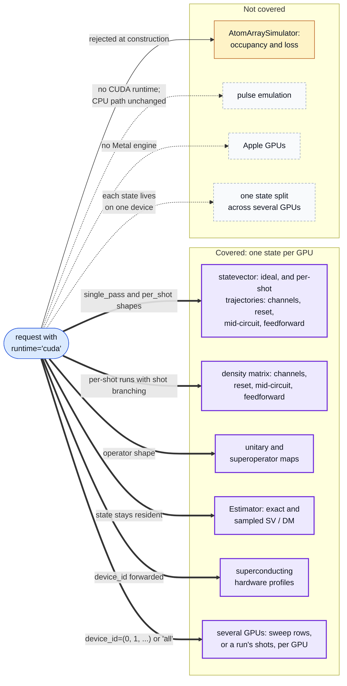

# CUDA coverage: which requests run on the GPU?

Which requests run on the GPU, and what happens to the rest: thin solid arrows end in `BackendValidationError`, dotted ones have no CUDA path at all.

Where in the code: `src/fatqat/simulator/simulator.py` (`_validate_runtime_config`), `src/fatqat/simulator/_engine/cupy.py` (`_supported_execution_shapes`, `CupySVEngine`), `src/fatqat/simulator/fake_atom_array.py`, `src/fatqat/simulator/fake_superconducting.py`; coverage table: [CUDA runtime guide](mkdocs/en/api/cupy-simulator.md).
