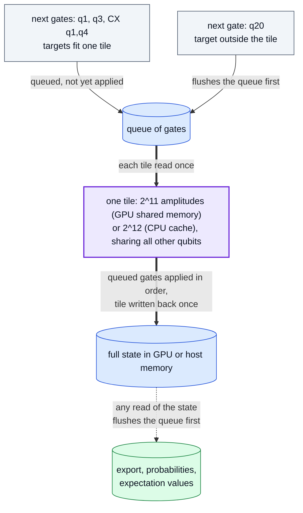

# Optimisations: what r9 and r10 change, and why accuracy and memory do not

r9 adds three things on top of the r8 CUDA engine, and r10 refines two of
them. Each was kept only if it met three rules: it helps CPU-only users as
well as GPU users, it is at least as accurate as the code it replaces, and it
uses no more memory.

| Change | Runtimes | Accuracy | Memory |
| --- | --- | --- | --- |
| Gate tiles (r9); controls and diagonal gates take no tile bit (r10) | CUDA statevectors and unitaries (shared memory), Numba statevectors (CPU cache) | equal to the per-gate kernels | unchanged; tiles live in on-chip memory |
| `simulation_config={"simplify": True}`: exact gate algebra (r10) | every runtime and method | never more rounding; closer to the ideal circuit where rounding gates cancel | unchanged; a planning step on the host |
| `device_id=(0, 1, ...)` for `run_sweep` | CUDA | bit-identical to a one-GPU sweep | one copy of the state per GPU used |

## Gate tiles

Every one- or two-qubit gate used to be one full pass over the state. A run
of consecutive qubit gates whose targets fit in one tile is now applied tile
by tile: each tile is read once, all the gates of the run are applied to it
in order, and it is written back once. The per-amplitude arithmetic is the
per-gate kernels' own, so results are bit-identical; tests compare them with
exact array equality.

A unitary's gates act on its row index, so the same queue serves the CUDA
unitary method with the target bits offset above the column bits.

**r10: only the qubits a gate moves take tile bits.** A diagonal gate (`T`,
`CZ`, `CPhase`, `RZ`) multiplies each amplitude by an entry chosen by the
amplitude's own index bits, wherever they lie, so it needs no tile bit. A
control (a target the gate never flips, with the identity on its other
value) needs none either: inside the tile it is tested per pair of
amplitudes, outside it once per tile. Only the remaining *active* targets, at
most two, must fit in the tile. A quantum Fourier transform is then one pass
per tile of Hadamards, and Toffolis (`CCX`), Fredkins and `CCZ` tile too. The
classification (`_TileForm`) is exact, with no tolerance, and is shared by
the Numba and CUDA kernels. Where a control does not hold or a diagonal
entry is exactly 1 the gate is skipped; the full gate would multiply by
exact ones and add exact zeros there, so values are unchanged. This follows
the "insular qubits" of the Atlas simulator ([arXiv:2408.09055](https://arxiv.org/abs/2408.09055)).

## Simplification

`simulation_config={"simplify": True}` simplifies the circuit before
execution, in the style of a course on circuit synthesis: gates are tensors,
so neighbouring gates can be multiplied out, identities removed, and gates
commuted past each other to meet their inverses.

**Exact algebra.** Products are computed exactly, never in floating point.
Every entry of the gates the pass works with lies in the ring
`Z[ω] / √2^k`, `ω = e^{iπ/4}`: unit gates (entries `0`, `±1`, `±i`, one per
row and column: Paulis, `S`, `CX`, `CZ`, `SWAP`, level permutations) by their
content, and the built-in `H`, `T`, `T†` and `SX` by their declared identity.
So `H·X·H = Z`, `H·Z·H = X`, `H·H = I`, `T·T = S`, `S·S = Z`,
`(H⊗H)·CX·(H⊗H)` = the reversed `CX`, three `CX` = `SWAP`, and `CX` gates
sharing a control commuting are equalities, decided exactly. One-qubit gates
are absorbed into neighbouring two-qubit gates, and gates move back across
steps they commute with exactly (disjoint, both diagonal, or equal products
in both orders).

**Scaled permutations.** A gate with one nonzero per row and column whose
entries round (`RZ`, `CPhase`) is kept as its exact entries and multiplied only
by permutations with entries `±1`, which move and negate entries without
rounding. `CX·RZ·CX`, the `ZZ` term of QAOA, becomes one diagonal, which tiles
then apply without a tile bit. A `±i` factor is refused: it swaps real and
imaginary parts, so with fused multiply-adds the rotation's products would
pair, and round, differently.

**Never more rounding.** A run is replaced by its product only when that
costs no more rounding (products summed into each amplitude) and fewer passes;
the product is the exact result rounded once. A gate that rounds is moved,
or moved past one that rounds, only when the merge removes rounding, because
floating point neither distributes nor reassociates. Rewrites among unit
gates and scaled permutations leave every value unchanged on the Numba and
CUDA runtimes; the others change values only by removing rounding, so against
the ideal circuit the result is at least as accurate. FatQat's built-in `H`
and `T` store `1/√2` as `0.7071067811865475`, one unit in the last place
below the correctly rounded value, so an exact `Z` in place of `H·X·H` is
measurably closer to the ideal circuit.

**Known inputs.** From the all-zero start (no `initial_state`, statevector or
density matrix), subsystems still in a known basis state are tracked. A gate
that acts as the identity on that input is dropped (a `CX` whose control is
still `|0⟩`), and one whose known inputs select a smaller block becomes that
block (a `CX` whose control is known `|1⟩` becomes an `X`). The amplitudes it
skips are exact zeros, so values are unchanged.

Measurements, resets, channels, loss and reloads are never crossed, because
their renormalization sums over the whole state in memory order. A global
phase is never discarded. On the NumPy runtime, which contracts through BLAS,
some BLAS builds round an element by a fused or unfused path depending on its
position, so even exact rewrites can move another gate's last-bit rounding
there (at most `2.4·10⁻¹⁶` in the tests, unbiased).

Where in the code: `src/fatqat/_backends/simplify.py`, called from `Simulator._prepare_execution` in `src/fatqat/simulator/simulator.py`; tests: `tests/simulator/test_simplify.py`; measurement: `perf/simplify_check.py`.

## Several GPUs for one sweep

`Simulator(runtime="cuda", device_id=(0, 1)).run_sweep(...)` runs the
rows on every listed GPU, one worker thread and engine per GPU, and returns
results in input order. `run()` uses the first device. Scaling is limited by
the per-row work done in Python, which runs one thread at a time.

Where in the code: `Simulator._run_sweep_on_devices` in `src/fatqat/simulator/simulator.py`; tests: `tests/simulator/test_cuda_multi_device.py`.

## Measured results

All from 2026-10-06; every figure links its evidence file.

- **r9 vs r8 on one GPU, same run** ([ab-r8-r9.json](../results/ab-r8-r9.json)):
  statevector observable 2.09× (24 qubits), 2.22× (26), 2.15× (28); full
  statevector 1.36–1.77× (24–28). Density-matrix and unitary workloads, whose
  code did not change, were 0.96–1.04×, which is the run-to-run noise. GPU
  memory pool and host memory were equal in every pair.
- **Unitary tiles** ([ab-unitary-tiles.json](../results/ab-unitary-tiles.json)):
  1.29× (12 qubits), 1.28× (13) and 1.42× (14) in the same run on one GPU,
  equal memory; 0.97× at 11 qubits, where the state fits in L2 and tiles do
  not engage (noise). The CPU unitary engine is unchanged: splitting its
  column blocks finer to fit the cache was measured 0.38–0.91× and dropped.
- **CPU tiles** ([cpu-tiles.json](../results/cpu-tiles.json)): gate-core
  speed-up of the default 12-qubit tile over per-gate passes, measured in
  the same process on two machines.
- **r9 simplification** ([simplify.json](../results/simplify.json)): the
  unit-gate-only pass on a synthetic circuit (RY/RZ + CX layers with
  appended cancelling pairs): 1.72× (CPU A, 22 qubits) and 1.87× (CPU B, 24
  qubits) on Numba, and 1.01–1.71× on one GPU (22–28 qubits), with identical
  values.
- **r10 simplification, CPU** ([simplify-check.json](../results/simplify-check.json)):
  against the ideal circuit, 48 seeded circuits (Clifford+T with and without
  lecture-style redundancy, a Clifford+T adder, QAOA; 6 qubits): mean error
  0.78 eps with `simplify` against 2.92 eps without on NumPy, 0.77 against 2.89
  on Numba; paired difference −2.1 eps, standard error 0.36. At 20 qubits:
  Clifford+T adder 3.03× (NumPy) and 2.01× (Numba), redundant Clifford+T
  4.33× and 2.59×, QAOA 2.03× and 1.82×; a QFT with nothing to simplify
  0.96–0.99× (timing noise; the pass itself costs 0.3–3.5% of a run).
- **r10 tiles, CPU** ([tile-check.json](../results/tile-check.json)): Numba,
  24 qubits, same engine and process, against tiles where every target takes
  a bit: QFT 27 → 5 passes, 1.64×; Clifford+T 61 → 27 passes, 1.68×; QAOA
  1.50×; adder 1.48× (7 passes either way: there the gain is the cheaper
  residual gate). Against per-gate passes 2.2–2.5×. Every state equal to the
  per-gate one.
- **r10 on the GPU:** written to the same rules as the CPU tiles and tested
  on the CPU side; not yet measured on a GPU.
- **Several GPUs:** sweeps spread over two or more GPUs returned counts
  identical to a one-GPU sweep in every test; the speed-up is sublinear in
  the number of GPUs (see above). These measurements are not published.
