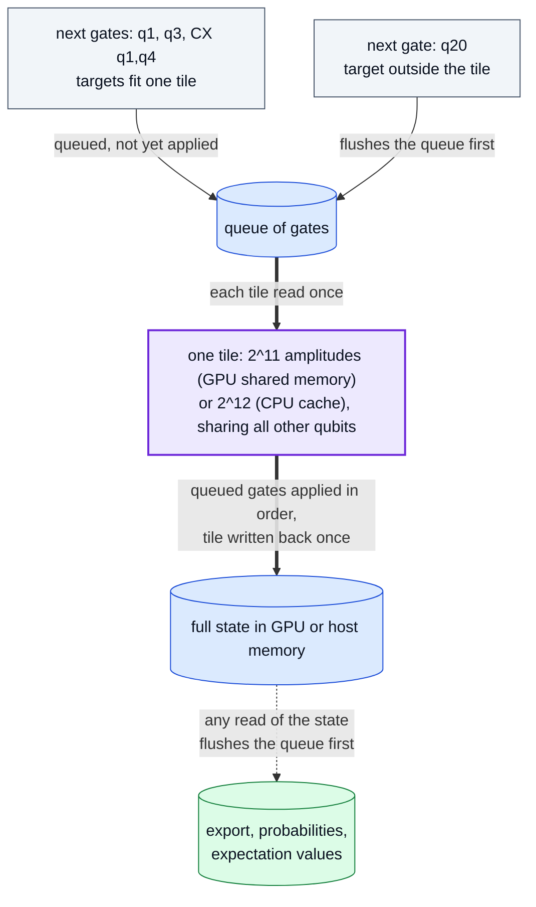

# Optimisations: what r9 to r12 change, and why accuracy and memory do not

r9 adds three things on top of the r8 CUDA engine, r10 refines two of them,
and r11 makes runs of many shots share their work and use several GPUs. Each
was kept only if it is as accurate as the code it replaces, or more (on
average, for `simplify`; see below), and its memory cost is stated. The table
says which runtimes each change helps: several are GPU-only.

| Change | Runtimes | Accuracy | Memory |
| --- | --- | --- | --- |
| Gate tiles (r9); controls and diagonal gates take no tile bit (r10) | CUDA statevectors and unitaries (shared memory), Numba statevectors (CPU cache) | equal to the per-gate kernels | unchanged; tiles live in on-chip memory |
| `simulation_config={"simplify": True}`: exact gate algebra (r10) | every runtime and method | never more rounding operations; closer to the ideal circuit on average (no per-circuit bound: a circuit can end up slightly worse) | unchanged; a planning step on the host |
| `simplify="auto"`, the default (r12) | Numba and CUDA, states large enough for the pass to pay | bit-identical: only rewrites that round nothing | unchanged |
| Phase folding in `simplify=True` (r12) | every runtime and method | as `simplify=True`: never more rounding | unchanged |
| `device_id=(0, 1, ...)` or `"all"` for `run_sweep` and shot runs; one worker process per further GPU (r11) | CUDA | bit-identical to a one-GPU run | one copy of the state per GPU used |
| Exact shot branching (r11) | every runtime, statevector and density-matrix runs of many shots | every shot's classical bits bit-identical to running it alone | pending states held to 1 GiB, or 8 states within half the free memory, then shot by shot |

## Gate tiles

Every one- or two-qubit gate used to be one full pass over the state. A run
of consecutive qubit gates whose targets fit in one tile is now applied tile
by tile: each tile is read once, all the gates of the run are applied to it
in order, and it is written back once. The per-amplitude arithmetic is the
per-gate kernels' own, so results are equal in value; tests compare them
with exact array equality (which counts +0 and -0 as equal).

A unitary's gates act on its row index, so the same queue serves the CUDA
unitary method with the target bits offset above the column bits.

**r10: only the qubits a gate moves take tile bits.** A diagonal gate (`T`,
`CZ`, `CPhase`, `RZ`) multiplies each amplitude by an entry chosen by the
amplitude's own index bits, wherever they lie, so it needs no tile bit. A
control (a target the gate never flips, with the identity on its other
value) needs none either: inside the tile it is tested per pair of
amplitudes, outside it once per tile. Only the remaining *active* targets, at
most two, must fit in the tile. A quantum Fourier transform is then one pass
per tile of Hadamards, and Toffolis (`CCX`), Fredkins and `CCZ` tile too. The
classification (`_TileForm`) is exact, with no tolerance, and is shared by
the Numba and CUDA kernels. Where a control does not hold or a diagonal
entry is exactly 1 the gate is skipped; the full gate would multiply by
exact ones and add exact zeros there, so values are unchanged. This follows
the "insular qubits" of the Atlas simulator ([arXiv:2408.09055](https://arxiv.org/abs/2408.09055)).

## Simplification

`simulation_config={"simplify": True}` simplifies the circuit before
execution, using textbook circuit identities: gates are tensors,
so neighbouring gates can be multiplied out, identities removed, and gates
commuted past each other to meet their inverses.

**Exact algebra.** Products are computed exactly, never in floating point.
Every entry of the gates the pass works with lies in the ring
`Z[ω] / √2^k`, `ω = e^{iπ/4}`: unit gates (entries `0`, `±1`, `±i`, one per
row and column: Paulis, `S`, `CX`, `CZ`, `SWAP`, level permutations) by their
content, and the built-in `H`, `T`, `T†` and `SX` by their declared identity.
So `H·X·H = Z`, `H·Z·H = X`, `H·H = I`, `T·T = S`, `S·S = Z`,
`(H⊗H)·CX·(H⊗H)` = the reversed `CX`, three `CX` = `SWAP`, and `CX` gates
sharing a control commuting are equalities, decided exactly. One-qubit gates
are absorbed into neighbouring two-qubit gates, and gates move back across
steps they commute with exactly (disjoint, both diagonal, or equal products
in both orders).

**Scaled permutations.** A gate with one nonzero per row and column whose
entries round (`RZ`, `CPhase`) is kept as its exact entries and multiplied only
by permutations with entries `±1`, which move and negate entries without
rounding. `CX·RZ·CX`, the `ZZ` term of QAOA, becomes one diagonal, which tiles
then apply without a tile bit. A `±i` factor is refused: it swaps real and
imaginary parts, so with fused multiply-adds the rotation's products would
pair, and round, differently.

**Never more rounding.** A run is replaced by its product only when that
costs no more rounding (products summed into each amplitude) and fewer passes;
the product is the exact result rounded once. A gate that rounds is moved,
or moved past one that rounds, only when the merge removes rounding, because
floating point neither distributes nor reassociates. Rewrites among unit
gates leave every value unchanged on the Numba and CUDA runtimes, and so do
rotations merged with `±1` permutations on Numba and on CUDA statevectors;
on CUDA density matrices such a product can change the last bit, because
that kernel associates its two-sided product `U ρ U†` by the matrix's
structure. The others change values only by removing rounding, so against
the ideal circuit the result is closer on average (mean 0.78 against 2.92 eps
on 48 circuits), though removing one rounding can leave another's error
unbalanced: 6 of 48 circuits ended up to 0.061 eps worse, and no per-circuit
bound is claimed. FatQat's built-in `H`
and `T` store `1/√2` as `0.7071067811865475`, one unit in the last place
below the correctly rounded value, so an exact `Z` in place of `H·X·H` is
measurably closer to the ideal circuit.

**Known inputs.** From the all-zero start (no `initial_state`, statevector or
density matrix), subsystems still in a known basis state are tracked. A gate
that acts as the identity on that input is dropped (a `CX` whose control is
still `|0⟩`), and one whose known inputs select a smaller block becomes that
block (a `CX` whose control is known `|1⟩` becomes an `X`). The amplitudes it
skips are exact zeros, so values are unchanged.

Measurements, resets, channels, loss and reloads are never crossed, because
their renormalization sums over the whole state in memory order. A global
phase is never discarded. On the NumPy runtime, which contracts through BLAS,
some BLAS builds round an element by a fused or unfused path depending on its
position, so even exact rewrites can move another gate's last-bit rounding
there (at most `2.4·10⁻¹⁶` in the tests, unbiased).

**On by default, without changing a value (r12).** `simplify="auto"`, the
default, runs the same pass with the built-in `H`, `T`, `Tdg` and `SX` left
as they are, and so are rotations: only unit gates (entries `0`, `±1`,
`±i`) and gates on known basis inputs are rewritten (a known input only drops
a gate, or shrinks it to a unit gate). Unit products are exact in any order,
so every value is the plain run's on Numba and CUDA, for statevectors and
density matrices alike (checked bit for bit on counts and states in
`perf/differential_check.py`). Rotations stay out because CUDA's
density-matrix kernel associates its two-sided product `U ρ U†` by the
matrix's structure, and a built-in gate's key picks its own kernel there, so
a rotation merged into a permutation can round differently in the last bit. It runs only when the work per step
(amplitudes, times the shots for a run evolved shot by shot) reaches
`2^19` on Numba or `2^25` on CUDA, where the pass costs at most a few per
cent of a plain run of a circuit with nothing to simplify, and never on
NumPy, for the BLAS reason above, or for sweeps.
`result.metadata["simplification"]` records `{"applied": True, "steps":
[before, after]}` or `{"applied": False, "reason": ...}`. The run keeps the
execution path the plain circuit would take: removing gates after a
measurement can make it deferrable, and a single-pass run would draw other
random numbers, so `"auto"` does not re-plan the path (`True` does).

**Phase folding (r12).** In `simplify=True`, before the merge, each qubit
wire carries an affine parity of path variables: `X`, `CX`, `SWAP` and any
other affine 0/1 permutation update it, a diagonal gate leaves it, and any
other gate gives its wires fresh variables. A phase gate `diag(ω^a, ω^b)`
multiplies each path by a power of `ω` that depends only on its wire's
parity, so every phase on one parity sums, mod 8, into one gate at the first
place the parity appeared (Nam et al. 2018, routine 4), with no global phase
lost. A group is folded only when that removes rounding, or when nothing that
rounds lies between its first and last gate. Measurements, resets, channels,
loss and reloads end every group; conditioned gates and gates on qudits give
their wires fresh variables. Folding comes before the merge, which would
otherwise fuse `H T H` into a dense block that hides its phases; the two then
repeat, up to three rounds, while a round strictly lowers the cost (rounding
first, then steps). Neither pass ever adds rounding, so neither does the
result. On phase gadgets (`CX`
ladders around `T`, `Tdg` or `S` on recurring parities) this is where most of
the gain comes from.

Where in the code: `src/fatqat/_backends/simplify.py`, called from `Simulator._prepare_execution` in `src/fatqat/simulator/simulator.py`; tests: `tests/simulator/test_simplify.py`; measurement: `perf/simplify_check.py`.

## Several GPUs for sweeps and shots

`Simulator(runtime="cuda", device_id=(0, 1)).run_sweep(...)` runs the
rows on every listed GPU, one worker thread and engine per GPU, and returns
results in input order. `device_id="all"` lists every visible GPU, counted
when execution first starts.

A `run()` of independent shots (statevector trajectories, or a density matrix
with mid-circuit measurement) splits its shots, in order, into one batch per
GPU, when its random steps before the last (which builds no state) have at
least as many outcomes as there are shots; a density matrix applies channels
and resets exactly, so only its measurements count.
With fewer, every batch would meet the same branches and evolve them again (an
ideal circuit with three mid-circuit measurements, 8 branches for 256 shots,
ran at 0.90x on two GPUs), so such a run stays on one GPU. Each shot draws only from its own seed stream, so the counts are those
of one GPU running every shot. The first GPU's batch runs in the calling
process; each further GPU's runs in its own worker process, started by loky
as a fresh interpreter (so no CUDA context is forked, and a script without a
`__main__` guard is not re-run), kept between runs, and closed after five idle
minutes. Threads were tried first and lost: each shot's loop is mostly
Python, threads take turns on the interpreter lock, and two GPUs on threads
were 0.67–0.80× of one at 20 qubits. A run whose final state is requested
keeps its shots on one GPU, and a row of a multi-GPU sweep runs its shots on
its own GPU.

Failures are reported, not hidden: every batch finishes before an error is
raised; the first GPU's own error comes first, then the others in device
order, each with a note naming its device. A worker that dies (a crash, or an
out-of-memory kill) fails its run with an error saying so, and the next run
starts a new one.

Where in the code: `Simulator._run_sweep_on_devices` and
`Simulator._run_shots_on_devices` in `src/fatqat/simulator/simulator.py`,
`_run_shots_on_device_workers` in `src/fatqat/simulator/_engine/parallel.py`;
tests: `tests/simulator/test_cuda_multi_device.py`.

## Exact shot branching

A run of many noisy or measured shots used to evolve every shot from the
start, although most shots spend most of the circuit in a state some other
shot is also in. Now shots travel in groups, one state per group:

- a deterministic step (a gate, or on a density matrix a channel or reset) is
  applied once per group;
- a random step (a Kraus channel, a measurement, a reset of a statevector) is
  weighed once on the group's state. Each shot then picks its branch from its
  own seed stream, in its own order, exactly as it would alone, and each
  picked branch is built once;
- a conditioned step splits the group by the shots' classical bits.

Every shot therefore makes the same draws through the same arithmetic as the
one-shot-at-a-time loop, so counts and classical bits are bit-identical. The
engines' random steps were split into three methods (weigh, pick, take), and
their one-shot methods are now built from those same three, so both paths run
literally the same code. Atom loss and reload continue shot by shot from the
group's state.

Memory stays bounded. A random step can split a group into as many parts as
it has shots, so the parts share what the step read (the state, or a
channel's weighed branches) and each builds its own state only when it runs.
The largest part goes on in place and the others wait. Waiting parts may hold
1 GiB of shared data, or 8 states where half the free device memory (or host
memory, where the system reports it) allows; past that, a waiting part runs
shot by shot at once. At the plan's last step no state is built at all, and
shots run in chunks of 4,096.

Two early versions were measured and fixed. The first built every
measurement outcome's state at once, which at 24 qubits held about 250 copies
of the state on a GPU.
The second let the first shot's part go on in place: when that shot drew a
rare noise branch, the large no-error group waited, overflowed the budget and
ran shot by shot (396 of 400 shots in a test, and two GPUs at 0.46× of one at
24 qubits, where one GPU's half of the shots happened to hit it). A fixed
1 GiB budget also left room for a single state at 26 qubits.

Where in the code: `src/fatqat/simulator/_engine/branching.py`, and the
weigh/pick/take methods in `np.py`, `nb.py` and `cupy.py`; tests:
`tests/simulator/test_shot_branching.py`, check 6 of
`perf/differential_check.py`; measurement: `perf/branching_check.py`.

## Measured results

All from 2026-10-06; every figure links its evidence file.

- **r9 vs r8 on one GPU, same run** ([ab-r8-r9.json](../results/ab-r8-r9.json)):
  statevector observable 2.09× (24 qubits), 2.22× (26), 2.15× (28); full
  statevector 1.36–1.77× (24–28). Density-matrix and unitary workloads, whose
  code did not change, were 0.96–1.04×, which is the run-to-run noise. GPU
  memory pool and host memory were equal in every pair.
- **Unitary tiles** ([ab-unitary-tiles.json](../results/ab-unitary-tiles.json)):
  1.29× (12 qubits), 1.28× (13) and 1.42× (14) in the same run on one GPU,
  equal memory; 0.97× at 11 qubits, where the state is small enough that
  tiles do not engage (noise). The CPU unitary engine is unchanged: splitting its
  column blocks finer to fit the cache was measured 0.38–0.91× and dropped.
- **CPU tiles** ([cpu-tiles.json](../results/cpu-tiles.json)): gate-core
  speed-up of the default 12-qubit tile over per-gate passes, measured in
  the same process on two machines.
- **r9 simplification** ([simplify.json](../results/simplify.json)): the
  unit-gate-only pass on a synthetic circuit (RY/RZ + CX layers with
  appended cancelling pairs): 1.72× (CPU A, 22 qubits) and 1.87× (CPU B, 24
  qubits) on Numba, and 1.01–1.71× on one GPU (22–28 qubits), with identical
  values.
- **r10 simplification, CPU** ([simplify-check.json](../results/simplify-check.json)):
  against the ideal circuit, 48 seeded circuits (Clifford+T with and without
  textbook redundancy, a Clifford+T adder, QAOA; 6 qubits): mean error
  0.78 eps with `simplify` against 2.92 eps without on NumPy, 0.77 against 2.89
  on Numba; paired difference −2.1 eps, standard error 0.36. At 20 qubits:
  Clifford+T adder 3.03× (NumPy) and 2.01× (Numba), redundant Clifford+T
  4.33× and 2.59×, QAOA 2.03× and 1.82×; a QFT with nothing to simplify
  0.96–0.99× (timing noise; the pass itself costs 0.3–3.5% of a run).
- **r10 tiles, CPU** ([tile-check.json](../results/tile-check.json)): Numba,
  24 qubits, same engine and process, against tiles where every target takes
  a bit: QFT 27 → 5 passes, 1.64×; Clifford+T 61 → 27 passes, 1.68×; QAOA
  1.50×; adder 1.48× (7 passes either way: there the gain is the cheaper
  residual gate). Against per-gate passes 2.2–2.5×. Every state equal to the
  per-gate one.
- **r10 tiles, GPU** ([tile-check-cuda.json](../results/tile-check-cuda.json)):
  one GPU, 26 qubits, timed to a device sync: QFT 47 → 7 passes, 2.48×
  over tiles where every target takes a bit; Clifford+T 1.36×, adder 1.21×,
  QAOA 1.06×; 1.7–4.1× over per-gate passes; every state equal to the
  per-gate one. Gates on three qubits that round (a three-qubit diagonal, a
  controlled two-qubit gate) stay out of CUDA tiles: alone they take a
  cuBLAS path whose rounding differs.
- **r10 simplification, GPU** ([simplify-check-cuda.json](../results/simplify-check-cuda.json)):
  error against the ideal circuit 0.81 eps with `simplify` against 3.08
  without; at 26 qubits, exact expectation values, redundant Clifford+T
  2.75×, QAOA 1.30×, adder 1.02×, QFT 0.97×. At 20 qubits planning cost
  more than a GPU saved (an unpublished measurement), so on the GPU
  `simplify` is for large states.
- **r10 accuracy** ([precision-r10.json](../results/precision-r10.json)):
  the 110 circuits of `precision.json` again, every runtime ≤ 2.9 eps; Numba
  minus GPU +0.047 eps (standard error 0.033). The GPU's complex products
  now use Kahan's algorithm for 2×2 determinants (each part within 2 ulp,
  even under cancellation), spelled out with explicit rounding so the
  per-gate kernels and the tiles agree bit for bit; left to the compiler,
  which product it fused differed between kernels.
- **Several GPUs:** sweeps spread over two or more GPUs returned counts
  identical to a one-GPU sweep in every test; the speed-up is sublinear in
  the number of GPUs (see above). These measurements are not published.
