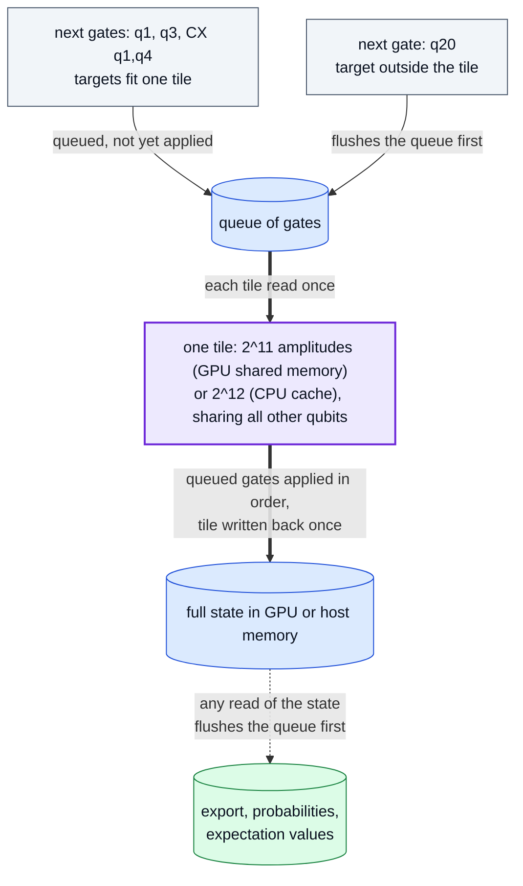

# Optimisations: what r9 changes, and why accuracy and memory do not

r9 adds three things on top of the r8 CUDA engine. Each was kept only if it
met three rules: it helps CPU-only users as well as GPU users, it is at least
as accurate as the code it replaces, and it uses no more memory.

| Change | Runtimes | Accuracy | Memory |
| --- | --- | --- | --- |
| Gate tiles | CUDA statevectors and unitaries (shared memory), Numba statevectors (CPU cache) | bit-identical to the per-gate kernels | unchanged; tiles live in on-chip memory |
| `simulation_config={"simplify": True}` | every runtime and method | identical values on Numba and CUDA | unchanged; a planning step on the host |
| `device_id=(0, 1, ...)` for `run_sweep` | CUDA | bit-identical to a one-GPU sweep | one copy of the state per GPU used |

## Gate tiles

Every one- or two-qubit gate used to be one full pass over the state. A run
of consecutive qubit gates whose targets fit in one tile is now applied tile
by tile: each tile is read once, all the gates of the run are applied to it
in order, and it is written back once. The per-amplitude arithmetic is the
per-gate kernels' own, so results are bit-identical; tests compare them with
exact array equality.

A unitary's gates act on its row index, so the same queue serves the CUDA
unitary method with the target bits offset above the column bits.

Where in the code: `src/fatqat/simulator/_engine/cupy.py` (`_GateTiles`, shared by `CupySVEngine` and `CupyUnitaryEngine`), `src/fatqat/simulator/_engine/nb.py` (`NumbaSVEngine.apply`, `_flush_pending`, `_apply_tiles`); tests: `tests/simulator/test_cuda_gate_tiles.py`, `tests/simulator/test_numba_tiles.py`.

- The tile always contains the lowest qubits (5 on the GPU, 3 on the CPU), so
  every read covers contiguous memory.
- Tiles engage only when the state is larger than the cache that per-gate
  passes already enjoy: the GPU's L2 cache (read from the device) and 32 MiB
  on the CPU. Below that, per-gate passes were measured as fast or faster.
- Mixed-radix systems and gates on three or more subsystems keep the per-gate
  paths.

## Simplification

`simulation_config={"simplify": True}` multiplies out runs of gates on the
same subsystems before execution and removes products equal to the identity,
in the style of the circuit identities `X·X = I`, `S·S = Z` and three CNOTs
forming a SWAP.

It only touches gates whose matrix entries are all `0`, `±1` or `±i`, with
one nonzero per row and column: Paulis, `S`/`Sdg`, `CX`, `CZ`, `SWAP`,
permutations and phase flips. Applying such a gate never rounds, so the
simplified circuit computes every amplitude exactly as the original does on
the Numba and CUDA runtimes, with fewer passes. Rotations and `H` are never
merged or moved, and measurements, resets, channels, loss and reloads are
never crossed, because their renormalization sums over the whole state in
memory order. Measured against an extended-precision reference, merging
them was less accurate: `H·H` in binary64 is `(1 + 1.4·10⁻¹⁶)` times the
identity and rounds to `(1 + 2.2·10⁻¹⁶)`, a bias on every amplitude, and even
an exactly representable product such as `RY·Z` adds the same terms in
another order when applied as one dense gate.

On the NumPy runtime, which contracts through BLAS, some BLAS builds round an
element by a fused or unfused path depending on its position; moving
amplitudes can then move another gate's last-bit rounding (at most
`2.4·10⁻¹⁶` in the tests, unbiased).

Where in the code: `src/fatqat/_backends/simplify.py`, called from `Simulator._prepare_execution` in `src/fatqat/simulator/simulator.py`; tests: `tests/simulator/test_simplify.py`.

## Several GPUs for one sweep

`Simulator(runtime="cuda", device_id=(0, 1)).run_sweep(...)` runs the
rows on every listed GPU, one worker thread and engine per GPU, and returns
results in input order. `run()` uses the first device. Scaling is limited by
the per-row work done in Python, which runs one thread at a time.

Where in the code: `Simulator._run_sweep_on_devices` in `src/fatqat/simulator/simulator.py`; tests: `tests/simulator/test_cuda_multi_device.py`.

## Measured results

All from 2026-10-06; every figure links its evidence file.

- **r9 vs r8 on one GPU, same run** ([ab-r8-r9.json](../results/ab-r8-r9.json)):
  statevector observable 2.09× (24 qubits), 2.22× (26), 2.15× (28); full
  statevector 1.36–1.77× (24–28). Density-matrix and unitary workloads, whose
  code did not change, were 0.96–1.04×, which is the run-to-run noise. GPU
  memory pool and host memory were equal in every pair.
- **Unitary tiles** ([ab-unitary-tiles.json](../results/ab-unitary-tiles.json)):
  1.29× (12 qubits), 1.28× (13) and 1.42× (14) in the same run on one GPU,
  equal memory; 0.97× at 11 qubits, where the state fits in L2 and tiles do
  not engage (noise). The CPU unitary engine is unchanged: splitting its
  column blocks finer to fit the cache was measured 0.38–0.91× and dropped.
- **CPU tiles** ([cpu-tiles.json](../results/cpu-tiles.json)): gate-core
  speed-up of the default 12-qubit tile over per-gate passes, measured in
  the same process on two machines.
- **Simplification** ([simplify.json](../results/simplify.json)): on a
  Clifford-rich circuit, 1.72× (CPU A, 22 qubits) and 1.87× (CPU B, 24
  qubits) on Numba, and 1.01–1.71× on one GPU (22–28 qubits), with identical
  values; errors against an extended-precision reference identical on all
  runtimes at 14 and 22 qubits. On circuits with no such gates nothing is
  merged and the cost is the planning step (about 1 ms per 350 gates).
- **Several GPUs:** sweeps spread over two or more GPUs returned counts
  identical to a one-GPU sweep in every test; the speed-up is sublinear in
  the number of GPUs (see above). These measurements are not published.
